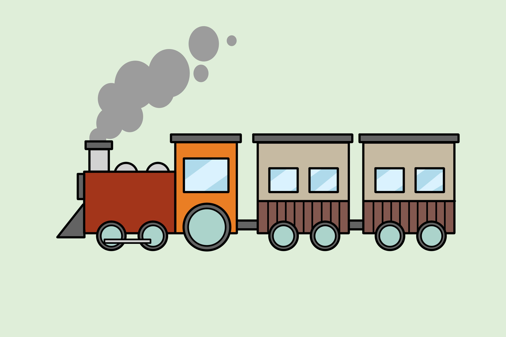

# Linked List

## Introduction to Linked List

Linked lists are linear data structures where elements are linked using pointers. Unlike arrays, linked lists do not have a fixed size and allow dynamic memory allocation. Elements are stored in nodes, each containing data and a reference (or pointer) to the next node.



## Implementing a Linked List in Python

In Python, you can create a basic linked list using classes to define nodes and the linked list itself:

```Python

class Node:
    def __init__(self, data):
        # Initializes a Node object with a given data value
        self.data = data
        self.next = None  # Pointer to the next node, initially set to None

class LinkedList:
    def __init__(self):
        self.head = None  # Initializes an empty linked list with no head node

    def append(self, data):
        # Adds a new node with the given data to the end of the linked list
        new_node = Node(data)  # Creates a new node object
        if not self.head:
            # If the linked list is empty, sets the new node as the head
            self.head = new_node
            return
        current = self.head
        while current.next:
            # Iterates through the linked list to find the last node
            current = current.next
        current.next = new_node  # Adds the new node at the end of the list

    def display(self):
        # Displays the elements of the linked list
        current = self.head
        while current:
            # Traverses through the linked list and prints each node's data
            print(current.data, end=" -> ")
            current = current.next
        print("None")  # Indicates the end of the linked list


```


## Example: Creating and Displaying a Linked List

```python

ll = LinkedList()  # Creates an instance of the LinkedList class

ll.append(5)       # Appends the value 5 to the linked list
ll.append(10)      # Appends the value 10 to the linked list
ll.append(15)      # Appends the value 15 to the linked list

ll.display()       # Displays the elements of the linked list
# Output: 5 -> 10 -> 15 -> None


```

## Problem Example - Detecting a Loop in a Linked List

One common challenge with linked lists is detecting a loop within the structure.

## Problem:

Write a function to detect if a linked list contains a cycle.

```python

def has_cycle(head):
    # Initialize two pointers, 'slow' and 'fast', both pointing to the head of the linked list
    slow = fast = head

    # Iterate through the linked list using two pointers
    while fast and fast.next:  # Check if 'fast' and 'fast.next' are not None (to avoid 'NoneType' errors)
        slow = slow.next  # Move 'slow' one step forward
        fast = fast.next.next  # Move 'fast' two steps forward

        # Check if the 'slow' and 'fast' pointers meet at the same node (indicating a cycle)
        if slow == fast:
            return True  # Return True if a cycle is detected

    # If the loop completes without detecting a cycle, return False
    return False  # Return False if no cycle is found in the linked list

```

## Explanation:

- The code uses two pointers, 'slow' and 'fast', initialized to the head of the linked list.
- It then traverses the linked list with 'slow' moving one step at a time and 'fast' moving two steps at a time.
- If there is a cycle in the linked list, 'slow' and 'fast' pointers will eventually meet at the same node.
- If they meet (indicating a cycle), the function returns True. Otherwise, if 'fast' reaches the end of the list (no cycle), it returns False.
- This approach, known as Floyd's Tortoise and Hare algorithm or the "two-pointer technique," efficiently detects cycles in a linked list by comparing the movement rates of two pointers, one moving faster than the other.

## Challenge Problem - Finding the Middle of a Linked List

Here's a challenge for you:

## Problem:

Write a function to find the middle element of a singly linked list. If the linked list contains an even number of elements, return the second middle element.

Here's the [solution](./solutions.py).

Feel free to try the challenge problem! If you need guidance, the solution is available for reference.

### Go back to [welcome](./0-welcome.md) page
