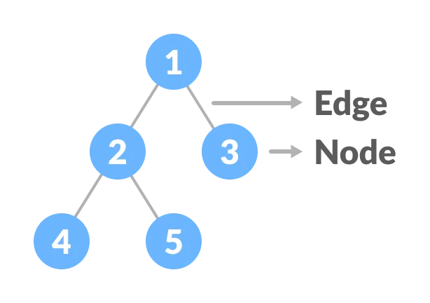

# Tree Data Structure

## Introduction to Trees

A tree is a hierarchical data structure composed of nodes. It starts with a root node and branches out, where each node has zero or more child nodes. Trees are widely used in computer science to represent hierarchical relationships.


## Implementing a Tree in Python

In Python, you can create a basic tree using classes to define nodes and their relationship:

```Python

class TreeNode:
    def __init__(self, data):
        # Initialize a TreeNode with a piece of data and an empty list to hold children
        self.data = data
        self.children = []

    def add_child(self, child):
        # Method to add a child node to the current node
        self.children.append(child)

```

## Explanation:

- class TreeNode:: Defines a class named TreeNode.
- def **init**(self, data):: This is the constructor method for the TreeNode class. It initializes a TreeNode object with a piece of data and an empty list (self.children) to hold its children.
- self.data = data: Assigns the input data to the self.data attribute of the TreeNode object.
- self.children = []: Initializes an empty list self.children to hold child nodes of the current TreeNode.
- def add_child(self, child):: Defines a method add_child within the TreeNode class. This method is used to add a child node to the current node.
- self.children.append(child): Appends the child node to the list of children (self.children) of the current TreeNode.

This TreeNode class serves as a basic structure to create nodes for a tree data structure. The add_child method allows you to add children to a particular node, making it possible to build a tree by linking nodes together. Each node (TreeNode) contains a piece of data and a list of its children.

## Example: Creating a Tree and Traversing Nodes

```python

# Create TreeNodes for nodes A, B, C, and D
root = TreeNode("A")  # Creating the root node 'A'
child1 = TreeNode("B")  # Creating a child node 'B'
child2 = TreeNode("C")  # Creating a child node 'C'
child3 = TreeNode("D")  # Creating a child node 'D'

# Adding child nodes B, C, D to the root node A
root.add_child(child1)  # Adding 'B' as a child of 'A'
root.add_child(child2)  # Adding 'C' as a child of 'A'
root.add_child(child3)  # Adding 'D' as a child of 'A'


```



## Traversing a Tree (Depth-First Traversal)

One common way to traverse a tree is through depth-first traversal methods such as pre-order, in-order, and post-order traversal.

```python

def pre_order_traversal(node):
    if node:
        print(node.data, end=" ")
        for child in node.children:
            pre_order_traversal(child)

# Example usage:
pre_order_traversal(root)  # Output: A B C D


```

## Problem Example - Tree Height Calculation

## Problem:

Write a function to calculate the height of a tree, considering the maximum depth from the root node to any leaf node.

```python

# Function to calculate the height of a tree
def tree_height(root):
    # If the root is empty (null), the height of the tree is 0
    if not root:
        return 0

    # Initialize the maximum height of children to 0
    max_child_height = 0

    # Traverse through each child of the root node
    for child in root.children:
        # Recursively calculate the height of each child node
        # and update the maximum child height
        max_child_height = max(max_child_height, tree_height(child))

    # Return the height of the tree, which is 1 (for the current node)
    # plus the maximum height among its children
    return 1 + max_child_height

```

## Explanation:

- The function tree_height calculates the height of a tree starting from a given root node.
- It first checks if the root node is empty. If it is, it means the tree has no nodes, so the height is 0.
- If the root node exists, it initializes max_child_height to 0. This variable will store the maximum height among its children.
- The function iterates through each child of the root node using a loop.
- For each child, it recursively calls the tree_height function to calculate the height of that child node.
- The max function is used to update max_child_height with the maximum height among the children nodes.
- Finally, the function returns the height of the tree, which is 1 (for the current node) plus the maximum height among its children. This process continues recursively until it reaches the leaf nodes and computes the height of the entire tree.

## Challenge Problem - Finding Nodes at a Given Level

Here's a challenge for you:

## Problem:

Write a function to find all nodes at a given level in a tree.

Here's the [solution](./solutions.py).

Feel free to try the challenge problem! If you need guidance, the solution is available for reference.
